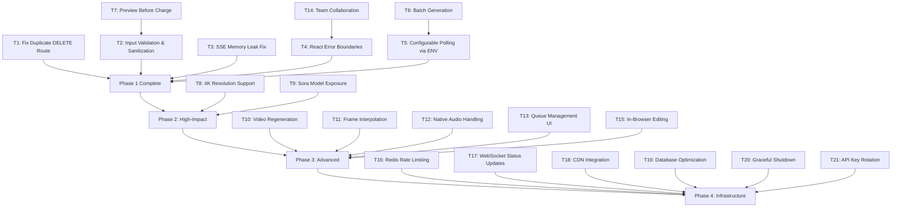

# Video Generation Platform - Development Roadmap Tasks

## Task Dependency Graph

---

## Phase 1: Critical Fixes (Week 1-2)

### T1: Fix Duplicate DELETE Route
**Status:** ✅ COMPLETED  
**Complexity:** Low  
**Files:** `apps/api/src/routes/videos.js`

**Steps:**
1. [x] Read videos.js and identify both DELETE route handlers
2. [x] Determine which handler has complete implementation
3. [x] Remove duplicate handler
4. [x] Test DELETE functionality

---

### T2: Input Validation & Sanitization
**Status:** ✅ COMPLETED  
**Complexity:** Low  
**Files:** `apps/api/src/routes/videos.js`, `apps/api/src/utils/inputSanitizer.js`, `apps/api/src/constants/validation.js`  
**New Files:** `inputSanitizer.js`, `validation.js`

**Steps:**
1. [x] Create `apps/api/src/constants/validation.js` with validation constants
2. [x] Create `apps/api/src/utils/inputSanitizer.js` with sanitization functions
3. [x] Import sanitization in videos.js POST handler
4. [x] Add prompt length validation (max 2000 chars)
5. [x] Add negative_prompt length validation (max 1000 chars)
6. [x] Apply sanitization before sending to GeminiGen
7. [x] Test invalid inputs return proper 400 errors

---

### T3: SSE Memory Leak Fix
**Status:** ✅ COMPLETED  
**Complexity:** Medium  
**Files:** `apps/api/src/routes/integrated-ai.js`

**Steps:**
1. [x] Read integrated-ai.js and identify all SSE connection paths
2. [x] Add abort controller for each SSE stream
3. [x] Add 'close' event handler to cleanup
4. [x] Add 'error' event handler to cleanup
5. [x] Ensure response is ended on cleanup
6. [x] Test memory under load with multiple connections

---

### T4: React Error Boundaries
**Status:** ✅ COMPLETED  
**Complexity:** Low  
**Files:** `apps/web/src/App.jsx`  
**New Files:** `apps/web/src/components/ErrorBoundary.jsx`

**Steps:**
1. [x] Create ErrorBoundary component with error state
2. [x] Add getDerivedStateFromError method
3. [x] Add componentDidCatch for logging
4. [x] Add render method with fallback UI
5. [x] Wrap GeneratePage with ErrorBoundary in App.jsx
6. [x] Wrap LibraryPage with ErrorBoundary in App.jsx
7. [x] Test error scenarios

---

### T5: Configurable Polling via ENV
**Status:** ✅ COMPLETED  
**Complexity:** Low  
**Files:** `apps/api/src/workers/generationProcessor.js`, `.env.example`

**Steps:**
1. [x] Read generationProcessor.js to find hardcoded values
2. [x] Replace MAX_POLL_ATTEMPTS with process.env
3. [x] Replace POLL_INTERVAL_MS with process.env
4. [x] Add default values matching current behavior
5. [x] Update .env.example with new variables
6. [x] Test with custom ENV values

---

## Phase 2: High-Impact Features (Week 3-6)

### T6: Batch Generation
**Status:** ✅ COMPLETED  
**Complexity:** High  
**Files:** `apps/api/src/routes/videos.js`, `apps/api/src/utils/creditCalculator.js`, `apps/api/src/workers/generationProcessor.js`, `apps/web/src/pages/GeneratePage.jsx`, `apps/web/src/api/videoApi.js`  
**New Files:** `apps/api/src/routes/batch.js`

**Steps:**
1. [x] Create batch.js route handler
2. [x] Implement batch size validation (1-5 prompts)
3. [x] Implement batch credit cost calculation
4. [x] Implement atomic batch transaction
5. [x] Implement individual generation queuing
6. [x] Add batch status tracking
7. [x] Add batch API methods in apiServerClient.js
8. [ ] Add batch input UI in GeneratePage (frontend)
9. [x] Implement partial failure handling
10. [ ] Test batch generation flow

**Dependencies:** T5 (Configurable Polling)

---

### T7: Preview Before Charge
**Status:** ✅ COMPLETED (Backend + API Client)  
**Complexity:** Medium  
**Files:** `apps/api/src/routes/videos.js`, `apps/api/src/api/geminigen.js`, `apps/api/src/constants/models.js`, `apps/web/src/pages/GeneratePage.jsx`  
**New Files:** `apps/api/src/routes/preview.js`, `apps/web/src/components/PreviewConfirmDialog.jsx`, `apps/web/src/lib/apiServerClient.js`

**Steps:**
1. [x] Add preview credit cost to validation.js
2. [x] Create preview.js route handler
3. [x] Implement 2-second low-res preview generation
4. [x] Store preview with "pending_confirmation" status
5. [x] Create /preview/:id/confirm endpoint
6. [x] Create /preview/:id/cancel endpoint
7. [x] Build PreviewConfirmDialog component
8. [x] Add preview API methods in apiServerClient.js
9. [ ] Integrate preview flow in GeneratePage (frontend)
10. [ ] Test confirm/cancel flows

**Dependencies:** T2 (Input Validation)

---

### T8: 4K Resolution Support
**Status:** ✅ COMPLETED  
**Complexity:** Low  
**Files:** `apps/api/src/constants/models.js`, `apps/api/src/utils/creditCalculator.js`, `apps/api/src/api/geminigen.js`, `apps/web/src/components/ResolutionPicker.jsx`

**Steps:**
1. [x] Add "4k" key to veo-3.1 model credits (2x 1080p)
2. [x] Add "4k" key to veo-3.1-fast model credits
3. [x] Add "4k" key to veo-3.1-lite model credits
4. [x] Credit cost calculation already handles 4K
5. [x] geminigen.js passes resolution directly to API
6. [ ] Update ResolutionPicker component (frontend)

---

### T9: Sora Model Exposure
**Status:** ⏸️ DEFERRED  
**Complexity:** Low  
**Files:** `apps/api/src/constants/models.js`, `apps/api/src/api/geminigen.js`, `apps/web/src/components/ModelPicker.jsx`

**Steps:**
1. [ ] Add Sora model to MODEL_VARIANTS in models.js
2. [ ] Configure credit costs for Sora (720p: 50, 1080p: 75)
3. [ ] Add /video-gen/sora routing in geminigen.js
4. [ ] Add Sora to ModelPicker component
5. [ ] Test Sora generation

**Note:** Deferred per user request - no need to add other models at this time.

---

## Phase 3: Advanced Features (Week 7-12)

### T10: Video Regeneration
**Status:** Pending  
**Complexity:** Medium  
**Files:** `apps/api/src/routes/video-regenerate.js`, `apps/web/src/pages/VideoDetailPage.jsx`

**Steps:**
1. [ ] Add POST /videos/:id/regenerate endpoint
2. [ ] Accept modified prompt as parameter
3. [ ] Preserve aspect ratio, resolution, model
4. [ ] Deduct new credit cost
5. [ ] Add regenerate button in VideoDetailPage
6. [ ] Test regeneration flow

---

### T11: Frame Interpolation
**Status:** Pending  
**Complexity:** Medium  
**Files:** `apps/api/src/constants/models.js`, `apps/api/src/api/geminigen.js`, `apps/web/src/components/ImageModePicker.jsx`

**Steps:**
1. [ ] Add "interpolation" to imageModes in models.js
2. [ ] Update geminigen.js for interpolation API
3. [ ] Add interpolation option in ImageModePicker
4. [ ] Test frame interpolation

---

### T12: Native Audio Handling
**Status:** Pending  
**Complexity:** High  
**Files:** `apps/api/src/api/geminigen.js`, `apps/api/src/constants/models.js`, `apps/web/src/pages/GeneratePage.jsx`  
**New Files:** `apps/web/src/components/AudioSettings.jsx`

**Steps:**
1. [ ] Add audio generation endpoints in geminigen.js
2. [ ] Add lip-sync endpoints in geminigen.js
3. [ ] Add audio-enabled models in models.js
4. [ ] Create AudioSettings component
5. [ ] Integrate audio options in GeneratePage
6. [ ] Test audio generation

---

### T13: Queue Management UI
**Status:** Pending  
**Complexity:** Medium  
**Files:** `apps/web/src/App.jsx`  
**New Files:** `apps/web/src/pages/QueuePage.jsx`, `apps/web/src/components/QueueItem.jsx`, `apps/api/src/routes/queue.js`

**Steps:**
1. [ ] Create queue.js API routes
2. [ ] Create QueuePage component
3. [ ] Create QueueItem component
4. [ ] Add /app/queue route in App.jsx
5. [ ] Integrate WebSocket for real-time updates (T17)
6. [ ] Test queue display

**Dependencies:** T17 (WebSocket)

---

### T14: Team Collaboration
**Status:** Pending  
**Complexity:** High  
**Files:** `apps/api/src/middleware/pocketbase-auth.js`, `apps/web/src/pages/AdminSettingsPage.jsx`  
**New Files:** `apps/api/src/routes/teams.js`, `apps/api/src/routes/team-members.js`, `apps/api/src/middleware/team-auth.js`, `apps/api/src/utils/teamCredits.js`, `apps/web/src/pages/TeamPage.jsx`

**Steps:**
1. [ ] Create teams.js route (CRUD for teams)
2. [ ] Create team-members.js (member management)
3. [ ] Create team-auth.js middleware
4. [ ] Create teamCredits.js utility
5. [ ] Create TeamPage in frontend
6. [ ] Add team management in AdminSettingsPage
7. [ ] Test team creation and member invites

**Dependencies:** T4 (Error Boundaries)

---

### T15: In-Browser Basic Editing
**Status:** Pending  
**Complexity:** High  
**Files:** (none)  
**New Files:** `apps/web/src/pages/EditorPage.jsx`, `apps/web/src/components/VideoTrimmer.jsx`, `apps/web/src/components/VideoMerger.jsx`, `apps/api/src/routes/editor.js`

**Steps:**
1. [ ] Create editor.js API routes (trim, merge endpoints)
2. [ ] Create EditorPage component
3. [ ] Create VideoTrimmer component
4. [ ] Create VideoMerger component
5. [ ] Add /app/editor route
6. [ ] Test trim and merge

---

## Phase 4: Infrastructure (Ongoing)

### T16: Redis Rate Limiting
**Status:** Pending  
**Complexity:** Medium  
**Files:** `apps/api/src/middleware/global-rate-limit.js`, `apps/api/src/middleware/generation-rate-limit.js`  
**New Files:** `apps/api/src/utils/redisClient.js`

**Steps:**
1. [ ] Create redisClient.js
2. [ ] Install rate-limit-redis package
3. [ ] Update global-rate-limit.js to use Redis
4. [ ] Update generation-rate-limit.js to use Redis
5. [ ] Add Redis URL to environment
6. [ ] Test distributed rate limiting

**Note:** Requires Redis infrastructure

---

### T17: WebSocket Status Updates
**Status:** Pending  
**Complexity:** High  
**Files:** `apps/api/src/main.js`  
**New Files:** `apps/api/src/websocket/generationSocket.js`, `apps/web/src/contexts/WebSocketContext.jsx`, `apps/web/src/hooks/useGenerationStatus.js`

**Steps:**
1. [ ] Setup WebSocket server in main.js
2. [ ] Create generationSocket.js handler
3. [ ] Create WebSocketContext.jsx
4. [ ] Create useGenerationStatus.js hook
5. [ ] Replace polling with WebSocket in GeneratePage
6. [ ] Test real-time status updates

---

### T18: CDN Integration
**Status:** Pending  
**Complexity:** Medium  
**Files:** `apps/api/src/routes/videos.js`  
**New Files:** `apps/api/src/utils/videoDelivery.js`

**Steps:**
1. [ ] Create videoDelivery.js with CDN URL generation
2. [ ] Update video responses to use CDN URLs
3. [ ] Configure CDN provider credentials
4. [ ] Test video delivery via CDN

**Note:** Requires CDN provider contract

---

### T19: Database Optimization
**Status:** Pending  
**Complexity:** Low  
**Files:** (Database migration)

**Steps:**
1. [ ] Create PocketBase migration for indexes
2. [ ] Add index on videos.user_id
3. [ ] Add index on videos.status
4. [ ] Add index on videos.created
5. [ ] Add index on transactions.user_id
6. [ ] Test query performance

---

### T20: Graceful Shutdown
**Status:** Pending  
**Complexity:** Medium  
**Files:** `apps/api/src/main.js`

**Steps:**
1. [ ] Add SIGTERM handler
2. [ ] Add SIGINT handler
3. [ ] Stop accepting new connections
4. [ ] Wait for in-flight requests (max 30s)
5. [ ] Close database connections
6. [ ] Force exit after timeout
7. [ ] Test shutdown behavior

---

### T21: API Key Rotation
**Status:** Pending  
**Complexity:** Medium  
**Files:** `apps/api/src/api/geminigen.js`  
**New Files:** `apps/api/src/utils/keyRotation.js`, `apps/api/src/utils/keyStore.js`

**Steps:**
1. [ ] Create keyStore.js for secure key storage
2. [ ] Create keyRotation.js for rotation logic
3. [ ] Implement automatic key rotation
4. [ ] Handle transition period (both keys valid)
5. [ ] Add logging for audit trail
6. [ ] Test rotation flow

---

## Summary

| Phase | Tasks | Total Estimated Time |
|-------|-------|---------------------|
| Phase 1 | T1-T5 | 1-2 weeks |
| Phase 2 | T6-T9 | 3-4 weeks |
| Phase 3 | T10-T15 | 5-6 weeks |
| Phase 4 | T16-T21 | Ongoing |

**Total Tasks:** 21  
**High Complexity:** 4 (T6, T12, T14, T15, T17)  
**Medium Complexity:** 7 (T3, T7, T10, T11, T13, T16, T18, T20, T21)  
**Low Complexity:** 10 (T1, T2, T4, T5, T8, T9, T19)